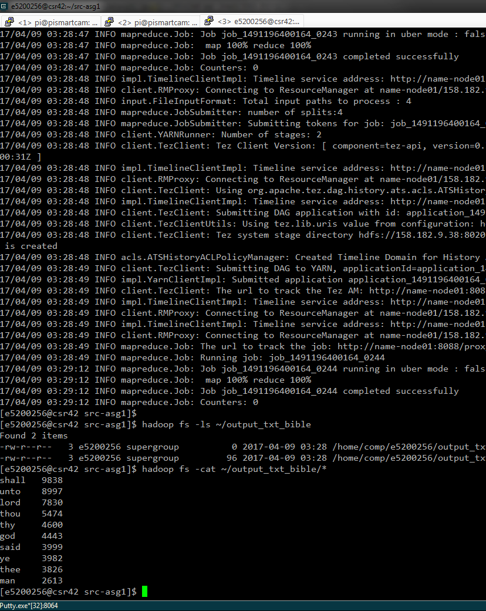
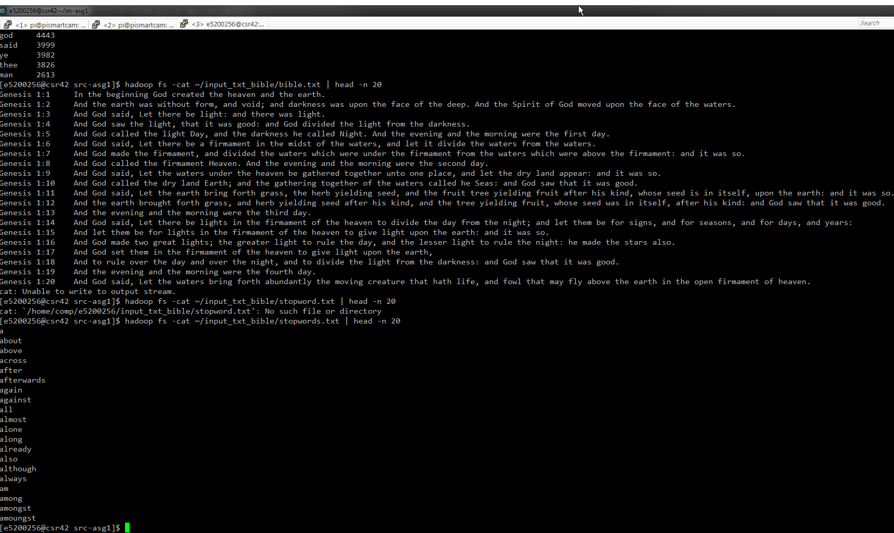
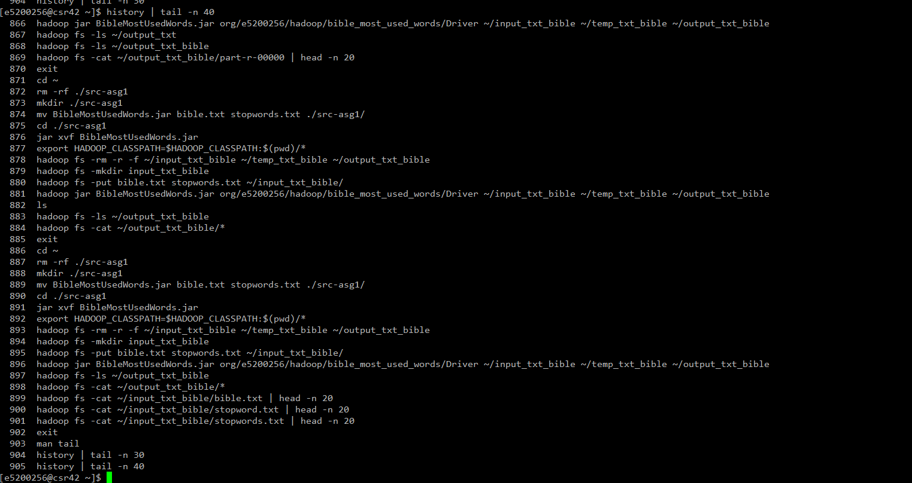

# Explanation of the program
*for Assignment 1 - Bible Word Count<br/>
of course COMP4057 Distributed and Cloud Computing<br/>
by Poon Chun Yiu (15200256)*

9 April 2017

## Screenshots
* Output of the program running<br/>
* Input: first 20 lines of both `bible.txt` and `stopwords.txt`<br/>
* Terminal history of `csr42` side<br/>

## Explanation of major steps
1. `Driver` contains the instructions for Hadoop to perform the job***s*** accordingly.
2. First, the `Driver` will start the job for `Counter`.<br/>

```
Job job1 = Job.getInstance(conf, "BibleMostUsedWords: Counter");

FileInputFormat.addInputPath(job1, new Path(rArgs[0]));
FileOutputFormat.setOutputPath(job1, new Path(rArgs[1]));

job1.setJarByClass(Counter.class);

job1.setMapOutputKeyClass(Text.class);
job1.setMapOutputValueClass(IntWritable.class);

job1.setOutputKeyClass(Text.class);
job1.setOutputValueClass(IntWritable.class);

job1.setMapperClass(Counter.CountMapper.class);
job1.setReducerClass(Counter.CountReducer.class);

if (!job1.waitForCompletion(true)) {
    System.exit(1);
    return;
}
```

3. `Counter` will first check if the Tab-Separated Values (but in `*.txt`) has exactly:
    * `1` column for stop words, and;
    * `2` columns for the bible data

4. ...And to let all text, except non alphabetical characters (i.e. regex=`[^A-Za-z]`), with its lower case, 
to be emitted by the mapper.
 
```
StringTokenizer st = new StringTokenizer(value.toString(), "\t"); // tab separated
if (st.countTokens() == 2) {
    // bible
    st.nextToken(); // omit (1)
    StringTokenizer stWords = new StringTokenizer(st.nextToken()); // space separated
    while (stWords.hasMoreTokens()) {
        String strWord = stWords.nextToken()
                .replaceAll("[^A-Za-z']", "")
                .toLowerCase()
                .trim();
        if (strWord.length() == 0) {
            continue;
        }
        word.set(strWord);
        context.write(word, positive);
    }
} else if (st.countTokens() == 1) {
    // stopwords
    String strWord = st.nextToken().toLowerCase();
    word.set(strWord);
    context.write(word, negative);
}
```

5. Note that for words in `bible.txt` will emit value of `1`, and for words in file `stopwords.txt` emitting `-1`.<br/>
This is to flag all stop words not to be counted on reduce stage.
6. The reducer will sum up the existences (`1`) of words in bible. <br/>
When flag (`-1`) is found, 
the reducer will skip the current word, which makes the word not to be shown on the (intermediate) output file.

```
int sum = 0;
for (IntWritable val : values) {
    if (val.get() < 0) {
        return;
    }
    sum += val.get();``````
}
result.set(sum);
context.write(key, result);
```

7. The `Driver` will then execute another job to sort and trim the counts of words.<br/>
Note that the number of reduce task is set to `1`.

```
Job job2 = Job.getInstance(conf, "BibleMostUsedWords: First10");

FileInputFormat.addInputPath(job2, new Path(rArgs[1]));
FileOutputFormat.setOutputPath(job2, new Path(rArgs[2]));

job2.setJarByClass(SwappedHead.class);

job2.setNumReduceTasks(1);

job2.setMapOutputKeyClass(IntWritable.class);
job2.setMapOutputValueClass(Text.class);

job2.setOutputKeyClass(Text.class);
job2.setOutputValueClass(IntWritable.class);

job2.setSortComparatorClass(SwappedHead.SHReverseComparator.class);

job2.setMapperClass(SwappedHead.SHMapper.class);
job2.setReducerClass(SwappedHead.SHReducer.class);

System.exit(job2.waitForCompletion(true) ? 0 : 1);
```

8. The `SwappedHead` will invert the Key-Value pair and emit it.

```
StringTokenizer st = new StringTokenizer(value.toString());
word.set(st.nextToken());
number.set(Integer.valueOf(st.nextToken()));
context.write(number, word);
```

9. We implement a new *reverse* `IntWritable` comparator to make the sorting produces a descending list.

```
@Override
public int compare(byte[] b1, int s1, int l1, byte[] b2, int s2, int l2) {
    return -1 * super.compare(b1, s1, l1, b2, s2, l2);
}
```

10. The `SHReducer` is set to trim the remaining items not to be emitted after 10 emits.

```
private int i = 0;
@Override
protected void reduce(IntWritable value, Iterable<Text> keys, Context context) throws IOException, InterruptedException {
    if (i >= 10) {
        return;
    }
    for (Text k: keys) {
        if (i++ >= 10) {
            break;
        }
        context.write(k, value);
    }
}
```
